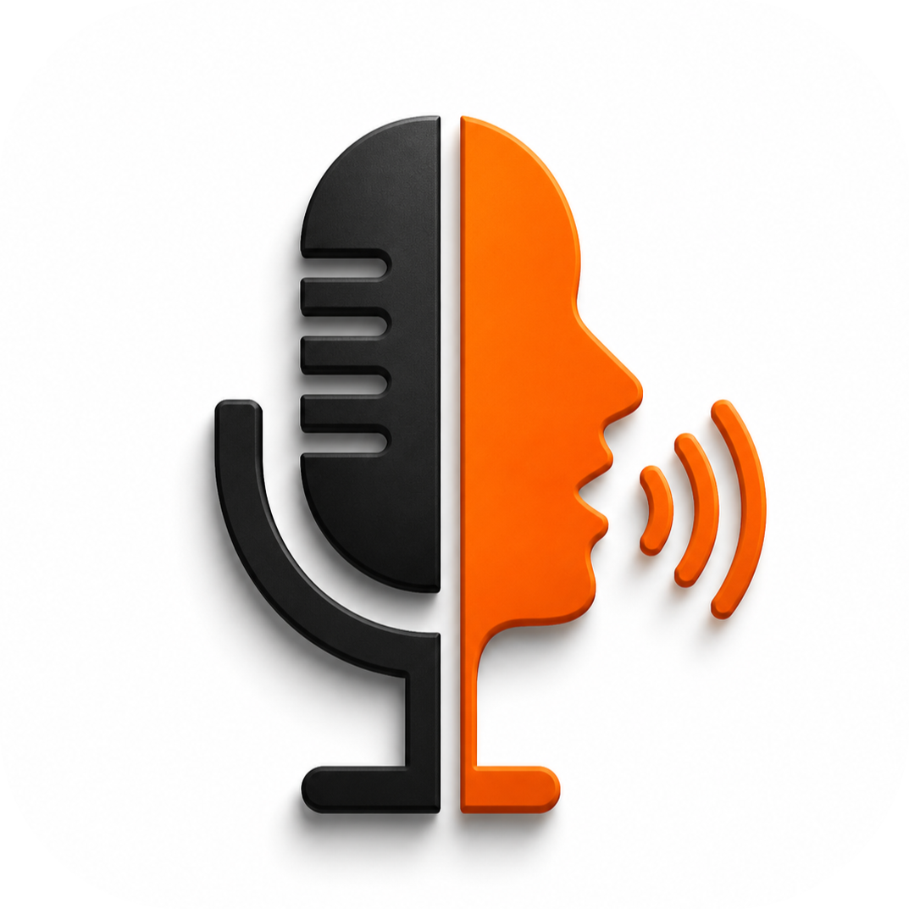

<div align="center">
  
  <h1>Voice Flow</h1>
  <p><em>Next-Generation Desktop Voice Dictation Assistant & Adaptive Speech Typist</em></p>
  
  [](LICENSE)
  [](https://www.python.org/)
  [](https://pyside.org/)
  [](https://github.com/SYSTRAN/faster-whisper)
</div>

---

## 🌟 Overview

**Voice Flow** (by **Forge**) is a high-speed, local-first desktop dictation tool engineered to convert spoken words into text instantly across any application on Windows. 

Featuring a fluid **floating glass capsule UI**, low-latency local speech recognition, and a **reinforcement learning engine**, Voice Flow automatically learns from your manual corrections to build a tailored custom dictionary of your vocabulary, acronyms, and technical jargon over time.

---

## ✨ Key Features

### 🎙️ Global PC Dictation (`Ctrl + Win`)
Press and hold `Ctrl + Win` from anywhere on your PC to record speech and automatically inject dictated text into **VS Code, Microsoft Word, Notion, Slack, Discord, or any browser tab** without switching windows.

### 🔮 Floating Glass Capsule UI
A translucent, non-intrusive floating control capsule that sits gracefully on your screen. Features:
- **Liquid Audio Soundwave**: Live 64-bar soundwave visualizer responding dynamically to your voice.
- **Smart Idle Transparency**: Automatically dims when inactive to avoid distracting your workflow.
- **Single-Instance Protection**: Enforces a single active capsule process (`QLocalServer` IPC lock). Re-opening the app instantly brings the existing capsule to focus.
- **Quick Controls**: Instant buttons for Settings, Dictation History, and Theme Toggles.

### 🧠 Q-Learning Reinforcement Learning Engine
Voice Flow features a real **Q-Learning Contextual Bandit RL Engine** ($Q \leftarrow Q + \alpha [R + \gamma Q_{\max} - Q]$):
- **Positive Rewards (+1.0)**: Accepted/kept dictations boost rule confidence Q-scores.
- **Negative Penalties (-1.5)**: Overridden or undone replacements trigger negative rewards, suppressing low-confidence rules ($Q < 0.4$).
- **Visual Q-Badges**: Monitor live rule confidence scores directly in the Settings Dictionary tab.

### ⚙️ Glassmorphic Settings Dashboard
Modern luxury card-based control center:
- **Speech Model Selector**: Switch between `tiny`, `base`, `small`, and `medium` Whisper AI models.
- **Microphone Device Picker**: Real-time audio input device selector with live VU meter.
- **Custom Hotkey Binder**: Bind your preferred global dictation trigger keys.
- **Dictionary Management**: View, add, edit, or remove custom phrase replacements and jargon.

### 🛡️ 100% Local-First Privacy
Your audio recordings and custom dictionary database remain strictly on your local computer. No cloud transfers, zero tracking, total privacy.

---

## 🏗️ Technology Stack

- **GUI Framework**: PySide6 (Qt 6 for Python) with custom QPainter rounded clipping & glassmorphism shaders.
- **Speech-to-Text**: Faster-Whisper (CTranslate2 optimized OpenAI Whisper models).
- **Audio Capture**: PyAudio stream handler with dynamic noise thresholding.
- **Database**: Local SQLite3 storage for custom vocabulary, usage metrics, and history.

---

## 🚀 Quick Start Guide

### Prerequisites
- **Windows 10 / 11 (64-bit)**
- **Python 3.10+**
- Working Microphone

### Installation

1. **Clone the Repository**:
   ```bash
   git clone https://github.com/Tarunparuchuri/Voice-Flow.git
   cd Voice-Flow
   ```

2. **Create & Activate Virtual Environment**:
   ```bash
   python -m venv .venv
   .venv\Scripts\activate
   ```

3. **Install Dependencies**:
   ```bash
   pip install PySide6 pyaudio faster-whisper pywin32
   ```

4. **Launch Application**:
   ```bash
   python main.py
   ```

---

## 🚀 Desktop Shortcut (Silent Terminal Launcher)

To launch Voice Flow gracefully without an annoying command prompt terminal window popping up:

Run the shortcut generator:
```bash
python create_shortcut.py
```
This generates a desktop shortcut `Voice Flow.lnk` linked with `pythonw.exe` and the rounded 3D `voiceflow_app.ico` icon.


---

## 📄 License

This project is open-source and licensed under the **MIT License**.